<h2>Tensorflow-Tiled-Image-Segmentation-OCDC (2024/05/06)</h2>

This is the first experimental Image Segmentation project for OCDC (Oral Cavity Derived Cancer) based on
the <a href="https://github.com/sarah-antillia/Tensorflow-Image-Segmentation-API">Tensorflow-Image-Segmentation-API</a>, and
<a href="https://drive.google.com/file/d/1vhCpb8V5vnBwNRKGk6HhFjpoUFOg2laX/view?usp=sharing">OCDC-ImageMask-Dataset-V1.zip</a>.
 

Actual Image Segmentation Sample for an image. 
<table>
<tr>
<th>Input: image</th>
<th>Mask (ground_truth)</th>
<th>Prediction: inferred_mask</th>
</tr>
<tr>
<td>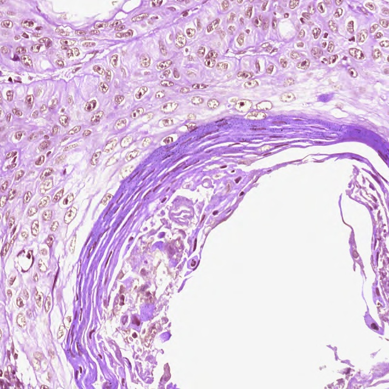</td>

<td></td>
<td>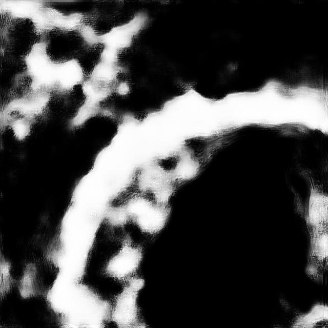</td>
</tr>
</table>

 
In this experiment, we have used the simple UNet Model 
<a href="./src/TensorflowUNet.py">TensorflowSlightlyFlexibleUNet</a> for this Oral Cancer Segmentation. 
As shown in <a href="https://github.com/sarah-antillia/Tensorflow-Image-Segmentation-API">Tensorflow-Image-Segmentation-API</a>.
you may try other Tensorflow UNet Models: 

<li><a href="./src/TensorflowSwinUNet.py">TensorflowSwinUNet.py</a></li>
<li><a href="./src/TensorflowMultiResUNet.py">TensorflowMultiResUNet.py</a></li>
<li><a href="./src/TensorflowAttentionUNet.py">TensorflowAttentionUNet.py</a></li>
<li><a href="./src/TensorflowEfficientUNet.py">TensorflowEfficientUNet.py</a></li>
<li><a href="./src/TensorflowUNet3Plus.py">TensorflowUNet3Plus.py</a></li>
<li><a href="./src/TensorflowDeepLabV3Plus.py">TensorflowDeepLabV3Plus.py</a></li>

 

<h3>1. Dataset Citation</h3>

The dataset used here has been taken from the following <a href="https://data.mendeley.com/datasets/9bsc36jyrt/1">
Mendeley Data 
H&E-stained oral squamous cell carcinoma histological images dataset</a>. 

<pre>
Freire, Dalí; Faria, Paulo; Loyola, Adriano; Cardoso, Sergio; 
Travencolo, Bruno; do Nascimento, Marcelo (2022), 
“H&E-stained oral squamous cell carcinoma histological images dataset”, 
Mendeley Data, V1, doi: 10.17632/9bsc36jyrt.1
</pre>

Please see also:<a href="https://data.mendeley.com/datasets/9bsc36jyrt/1/files/33368887-7fb7-4422-bf1e-c33c16104051">
MendeleyData_OCDC_2022.pdf</a>
 

 

<h3>
<a id="2">
2 OCDC ImageMask Dataset
</a>
</h3>
 If you would like to train this OCDC Segmentation model by yourself,
 please download the dataset from the google drive 
<a href="https://drive.google.com/file/d/1vhCpb8V5vnBwNRKGk6HhFjpoUFOg2laX/view?usp=sharing">OCDC-ImageMask-Dataset-V1.zip</a>.
 
Please expand the downloaded ImageMaskDataset and place it under <b>./dataset</b> folder to be
<pre>
./dataset
└─OCDC
    ├─test
    │   ├─images
    │   └─masks
    ├─train
    │   ├─images
    │   └─masks
    └─valid
        ├─images
        └─masks
</pre>

<b>OCDC Dataset Statistics</b> 
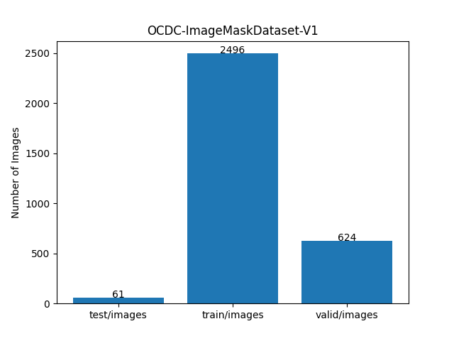 
 
As shown above, the number of images of train and valid dataset is not necessarily large. 
 

 
<b>Train_images_sample</b> 
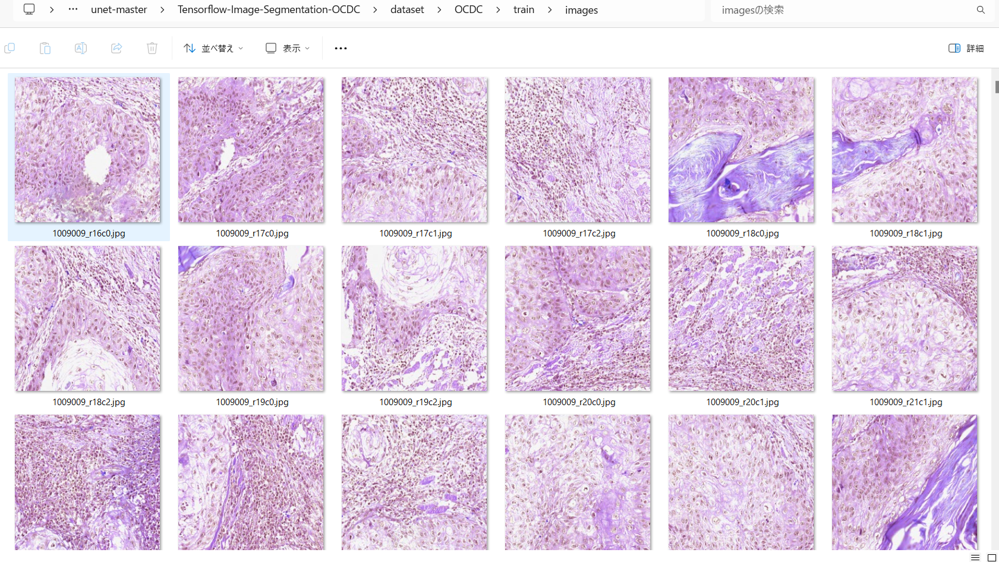
 
<b>Train_masks_sample</b> 
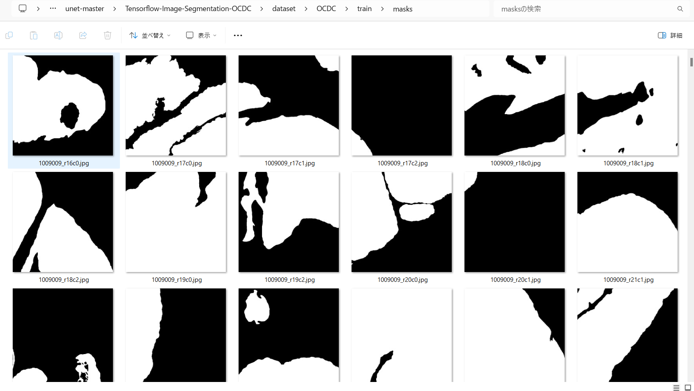
 

<h3>
4 Train TensorflowUNet Model
</h3>
 We have trained OCDC TensorflowUNet Model by using the following
<a href="./projects/TensorflowSlightlyFlexibleUNet/OCDC/train_eval_infer.config"> <b>train_eval_infer.config</b></a> file.  
Please move to ./projects/OCDC and run the following bat file. 
<pre>
>1.train.bat
</pre>
, which simply runs the following command. 
<pre>
>python ../../../src/TensorflowUNetTrainer.py ./train_eval_infer.config
</pre>
<pre>
; train_eval_infer.config
; 2024/05/05 (C) antillia.com

[model]
model         = "TensorflowUNet"
generator     = False
image_width    = 640
image_height   = 640
image_channels = 3
input_normalize = False
num_classes    = 1
base_filters   = 16
base_kernels   = (5,5)
num_layers     = 7
dropout_rate   = 0.05
learning_rate  = 0.0001
clipvalue      = 0.5
dilation       = (2,2)
loss           = "bce_dice_loss"
metrics        = ["binary_accuracy"]
show_summary   = False

[train]
epochs        = 100
batch_size    = 4
patience      = 10
;metrics       = ["iou_coef", "val_iou_coef"]
metrics       = ["binary_accuracy", "val_binary_accuracy"]
model_dir     = "./models"
eval_dir      = "./eval"
image_datapath = "../../../dataset/OCDC/train/images/"
mask_datapath  = "../../../dataset/OCDC/train/masks/"
create_backup  = False
learning_rate_reducer = True
reducer_patience      = 4
save_weights_only = True

[eval]
image_datapath = "../../../dataset/OCDC/valid/images/"
mask_datapath  = "../../../dataset/OCDC/valid/masks/"

[test] 
image_datapath = "../../../dataset/OCDC/test/images/"
mask_datapath  = "../../../dataset/OCDC/test/masks/"

[infer] 
images_dir    = "./mini_test/images"
output_dir    = "./mini_test_output"
;merged_dir   = "./mini_test_output_merged"
;binarize      = True
sharpening   = True

[segmentation]
colorize      = False
black         = "black"
white         = "green"
blursize      = None

[mask]
blur      = True
blur_size = (3,3)
binarize  = True
threshold = 127
</pre>

The training process has just been stopped at epoch 100 as shown below.  
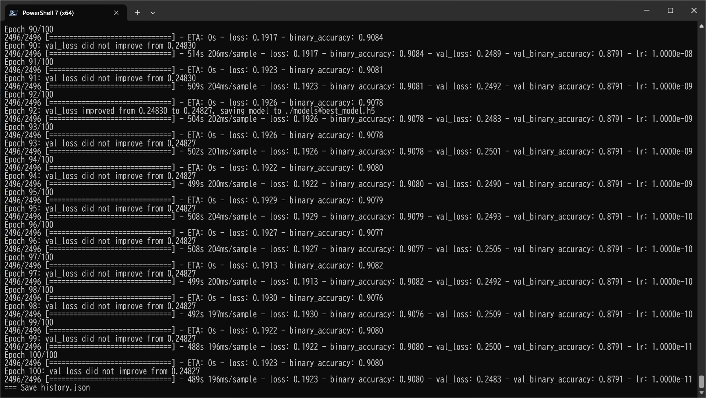 
 
 
<a href="./projects/TensorflowSlightlyFlexibleUNet/OCDC/eval/train_metrics.csv">train_metrics.csv</a> 
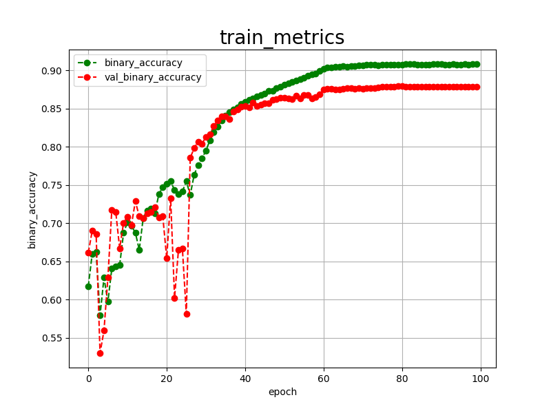 

 
<a href="./projects/TensorflowSlightlyFlexibleUNet/OCDC/eval/train_losses.csv">train_losses.csv</a> 
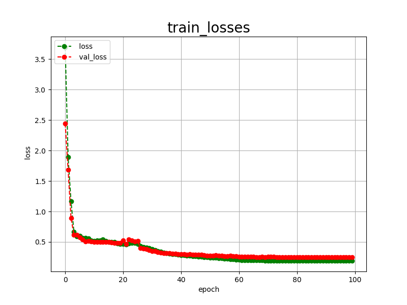 

 

<h3>
5 Evaluation
</h3>
Please move to a <b>./projects/TensorflowSlightlyFlexibleUNet/OCDC</b> folder, 
and run the following bat file to evaluate TensorflowUNet model for OCDC. 
<pre>
./2.evaluate.bat
</pre>
<pre>
python ../../../src/TensorflowUNetEvaluator.py ./train_eval_infer_aug.config
</pre>
Evaluation console output: 
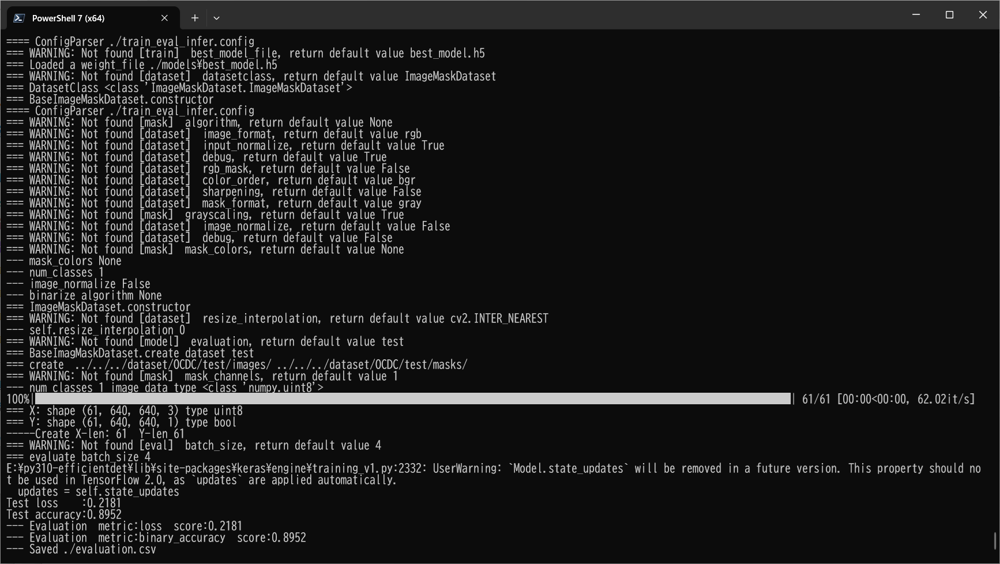
  
<a href="./projects/TensorflowSlightlyFlexibleUNet/OCDC/evaluation.csv">evaluation.csv</a> 
The loss (bce_dice_loss) score for this test dataset is not so low, and accuracy not so heigh as shown below. 
<pre>
loss,0.2181
binary_accuracy,0.8952
</pre>

<h3>
6 Inference
</h3>
Please move to a <b>./projects/TensorflowSlightlyFlexibleUNet/OCDC</b> folder 
,and run the following bat file to infer segmentation regions for images by the Trained-TensorflowUNet model for OCDC. 
<pre>
./3.infer.bat
</pre>
<pre>
python ../../../src/TensorflowUNetInferencer.py ./train_eval_infer_aug.config
</pre>
mini_test_images 
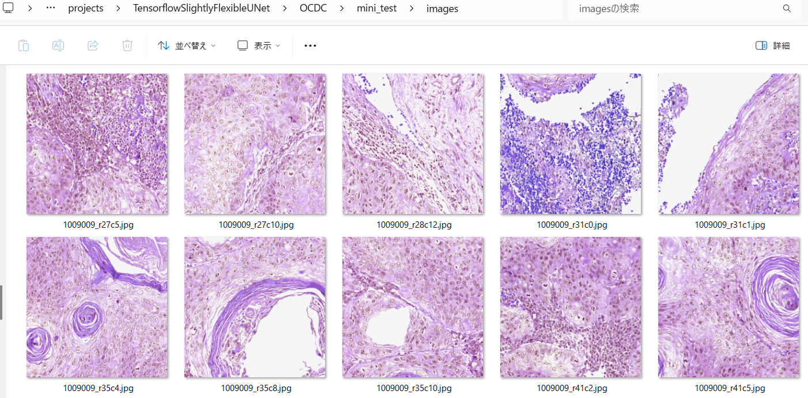 
mini_test_mask(ground_truth) 
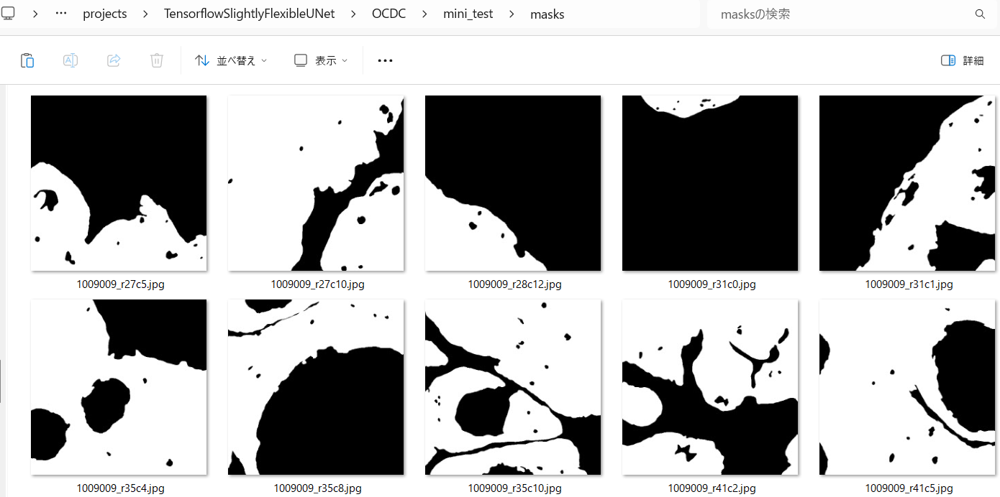 

Inferred test masks 
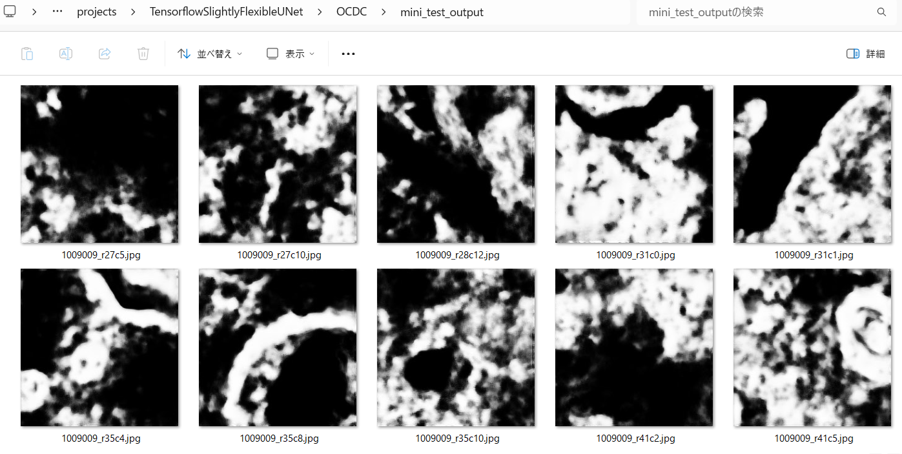 
 

<b>Enlarged images and masks </b> 

<table>
<tr>
<th>Image</th>
<th>Mask (ground_truth)</th>
<th>Inferred-mask</th>
</tr>

<tr>
<td>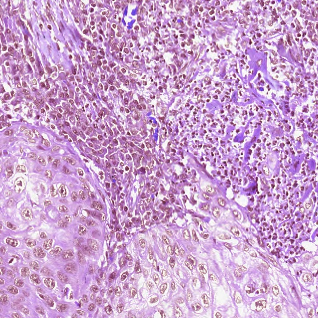</td>
<td></td>
<td>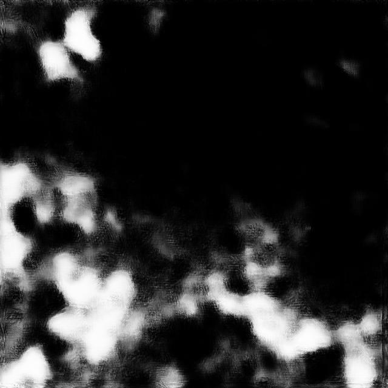</td>
</tr>

<tr>
<td>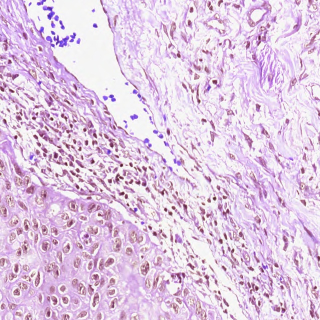</td>
<td></td>
<td>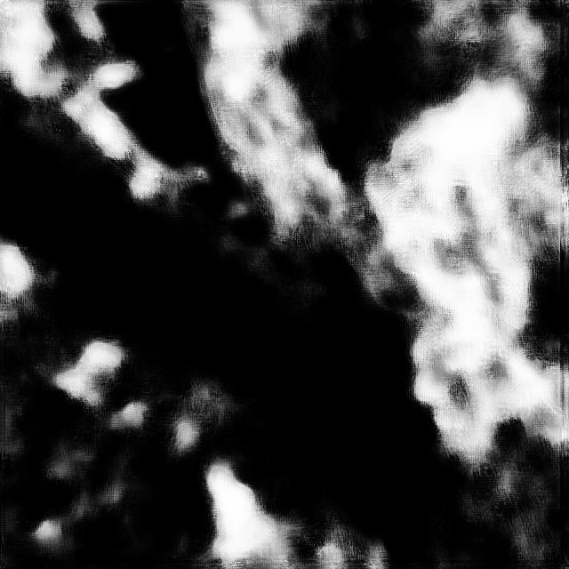</td>
</tr>

<tr>
<td>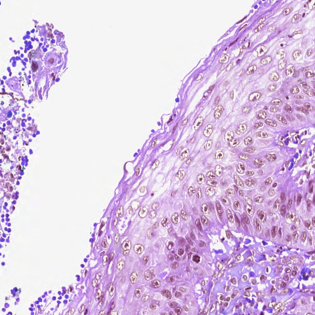</td>
<td>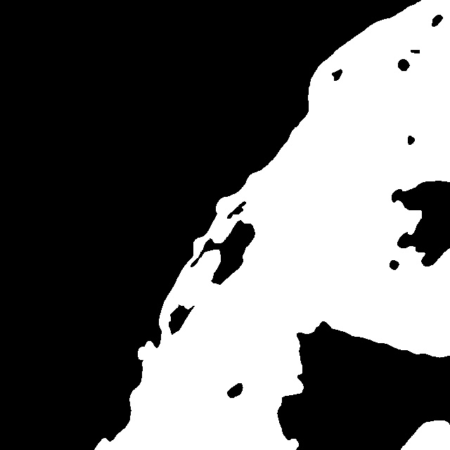</td>
<td>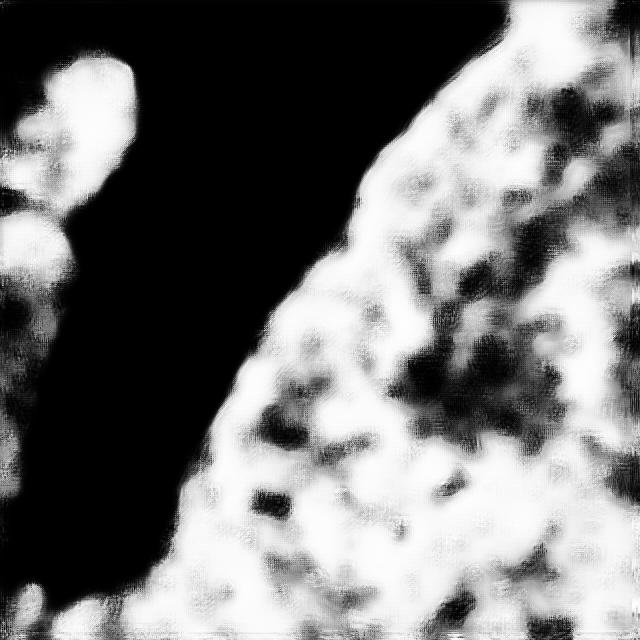</td>
</tr>

<tr>
<td></td>
<td></td>
<td></td>
</tr>
<tr>
<td>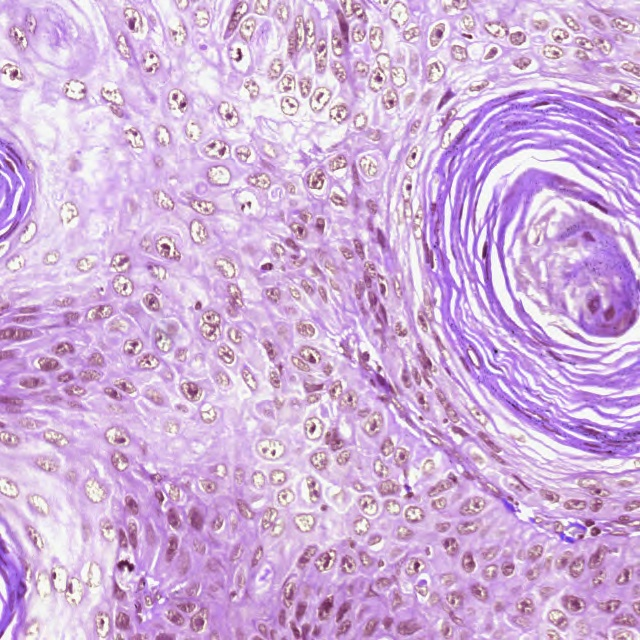</td>
<td>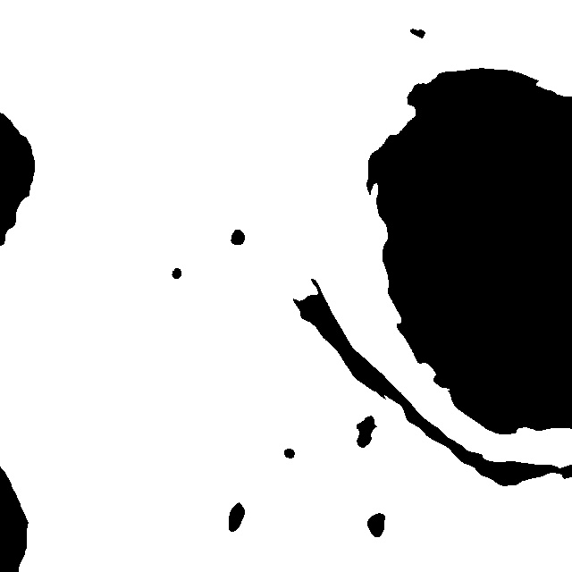</td>
<td>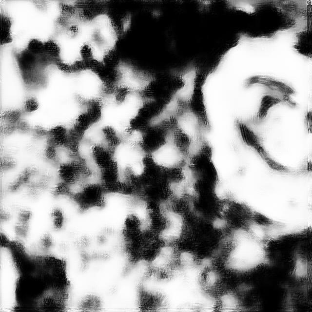</td>
</tr>

</table>
 
 

<h3>
References
</h3>
<b>1. Deep Learning-Based Pixel-Wise Lesion Segmentation on Oral Squamous Cell Carcinoma Images</b> 
Francesco Martino, Domenico D. Bloisi, Andrea Pennisi,Mulham Fawakherji,Gennaro Ilardi, 
Daniela Russo,Daniele Nardi,Stefania Staibano,and Francesco Merolla 
<pre>
https://www.mdpi.com/2076-3417/10/22/8285
</pre>
 

<b>2. OCU-Net: A Novel U-Net Architecture for Enhanced Oral Cancer Segmentation</b> 
Ahmed Albishria, Syed Jawad Shaha, Yugyung Leea and Rong Wang 

<pre>
https://arxiv.org/pdf/2310.02486
</pre>
 

<b>3. WSI tumor regions segmentation</b> 
Dalí Freire 
<pre>
https://github.com/dalifreire/tumor_regions_segmentation
</pre>
 

<b>4. ImageMask-Dataset-OCDC</b> 
Toshiyuki Arai antillia.com 
<pre>
https://github.com/sarah-antillia/ImageMask-Dataset-OCDC
</pre>

